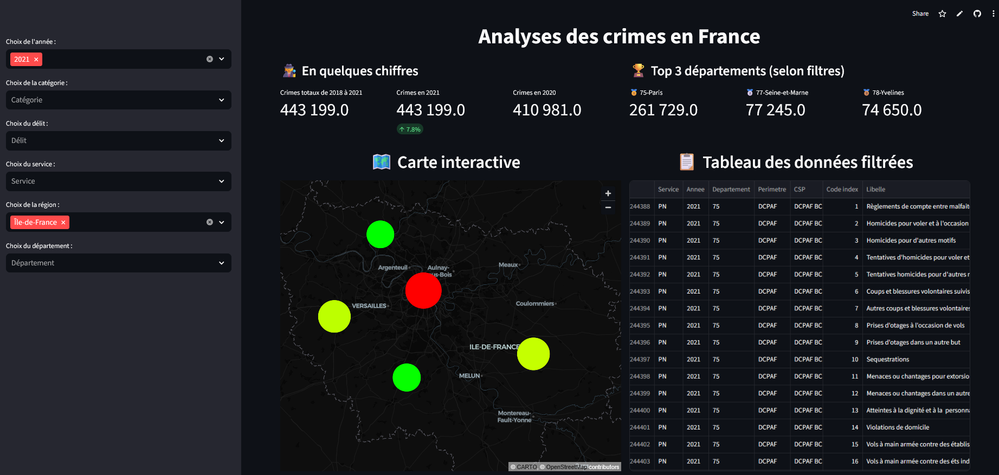

# Safe Town Insights  

         

---

 

## 📖 Description  

**Safe Town Insights** est un tableau de bord interactif permettant d’analyser les crimes et délits en France.  
Le projet utilise des données ouvertes issues de [data.gouv.fr](https://www.data.gouv.fr/) et propose une visualisation intuitive à travers **Streamlit** et **Pydeck**.  

👉 [Accéder au dashboard en ligne](https://safe-town-insights-gp7fgkquuznlfemnuwh9pm.streamlit.app/)  

---

## 🚀 Fonctionnalités  

- **Filtres interactifs** : année, catégorie de crime, délit, service, région, département.  
- **KPIs dynamiques** : nombre total de crimes, comparaison année N / N-1, évolution en %.  
- **Carte interactive** : deux modes disponibles :  
  - **Bulles (Bubble mode)** : taille des points proportionnelle et **normalisée** (max 30px, min 4px) → permet une meilleure lisibilité même au dézoom.  
  - **Heatmap** : carte mettant en évidence les zones à forte densité de crimes.   
- **Classement Top 3** : départements avec le plus grand nombre de crimes (selon filtres).  
- **Tableau filtré** : affichage direct des données filtrées.  

---

## 🛠️ Technologies utilisées  

- **Python** : traitement et analyse des données  
  - `pandas`  
  - `numpy`  
- **Visualisation** :  
  - `streamlit`  
  - `pydeck`  
- **Sources de données** :  
  - Données publiques issues de [data.gouv.fr](https://www.data.gouv.fr/)  
  - Données enrichies avec coordonnées géographiques des départements  

---

## 📊 Aperçu  

### Carte interactive des crimes en France  
- **Mode Bulles** :  
  - Couleur : du **vert (faible)** au **rouge (fort)** en fonction du volume de crimes.  
  - Taille : proportionnelle au nombre d’infractions, **normalisée avec un max de 30px**.  

- **Mode Heatmap** :  
  - Affiche la densité des crimes sous forme de carte thermique.  
  - Idéal pour une vue d’ensemble à l’échelle nationale. 

### KPIs dynamiques  
- Crimes totaux (2018–2021)  
- Crimes en année N  
- Crimes en année N-1 et variation %  

---

## 📌 Améliorations prévues  

- Analyse temporelle plus fine (séries chronologiques).  
- Comparaisons entre régions et départements.  
- Ajout de nouvelles visualisations (barplots, tendances).  
- Optimisation du chargement et de la gestion des données.  

---

## 👤 Auteur  

Développé par **Mohamed-Elhedi Kraiem**.  

- 📧 Email : mohamedelhedi.kr@gmail.com  
- 🔗 GitHub : [Mohamed-elhediKraiem](https://github.com/Mohamed-elhediKraiem)  
- 🔗 LinkedIn : [Mohamed-Elhedi KRAIEM](https://www.linkedin.com/in/mohamed-elhedi-kraiem-49677a178/)  
